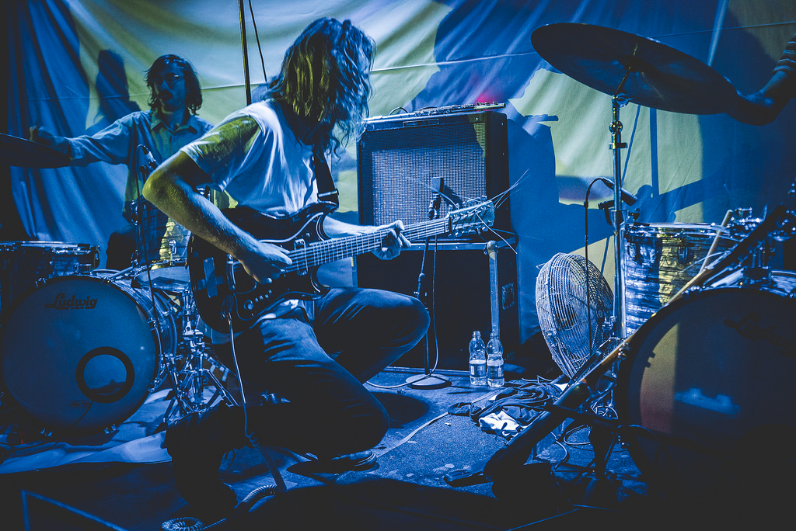
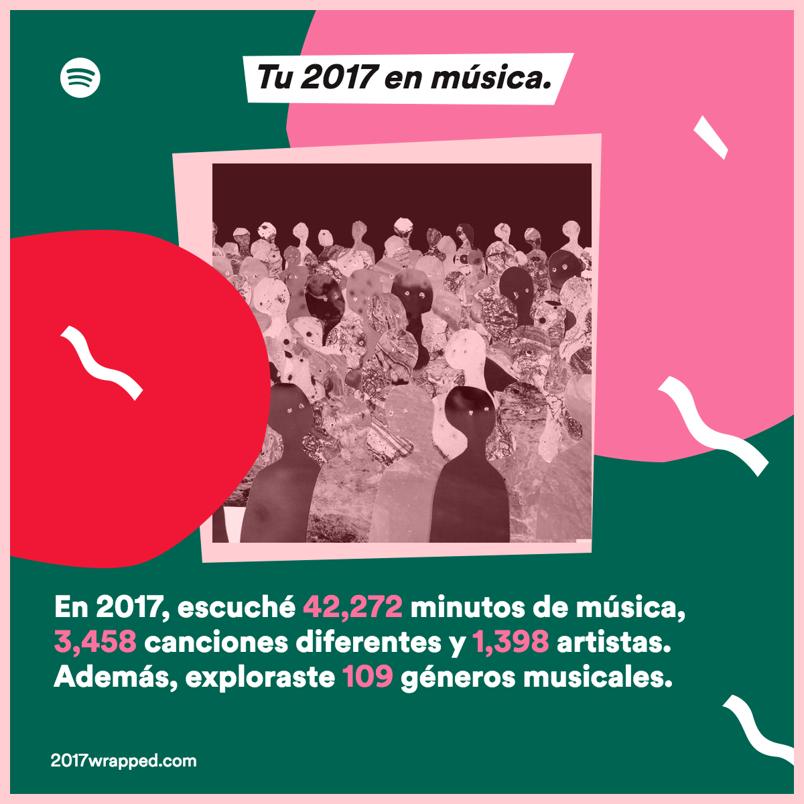
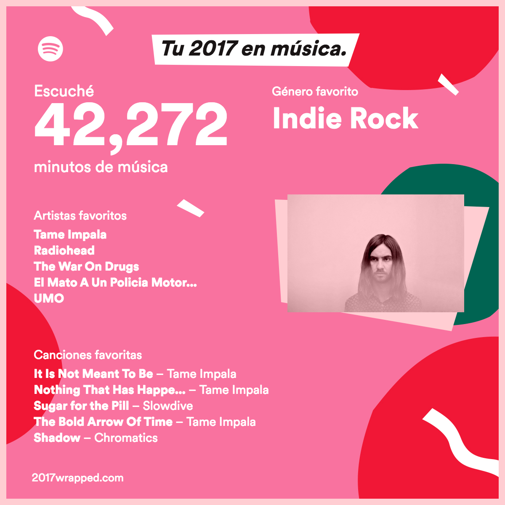
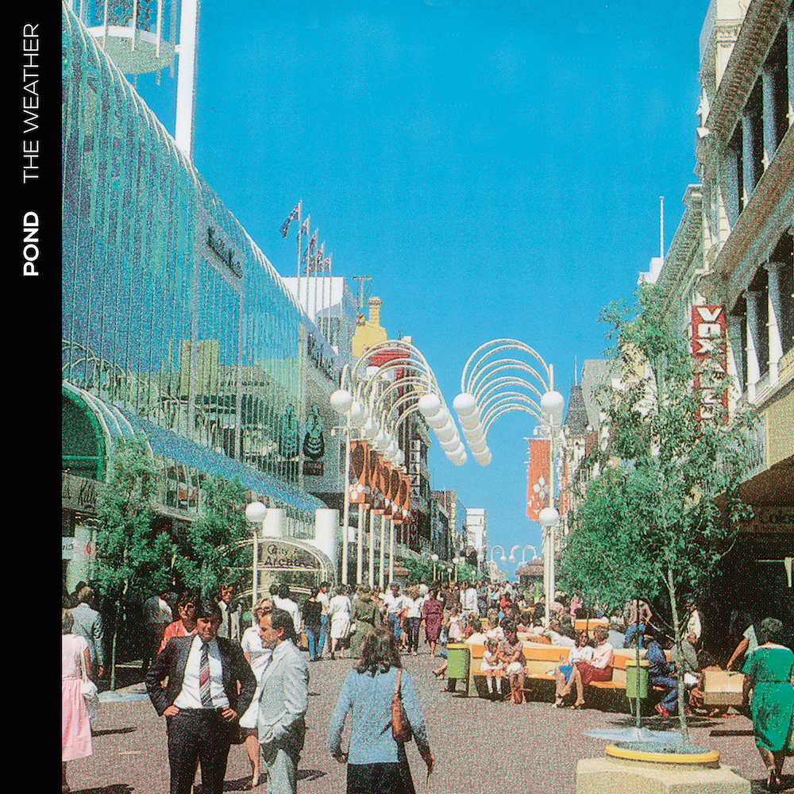
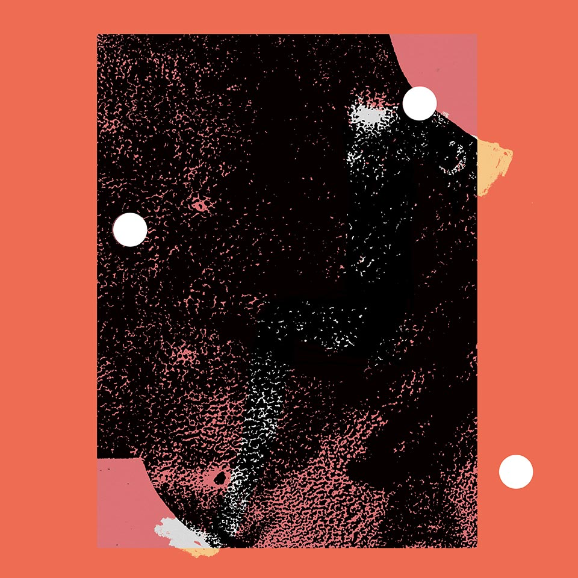
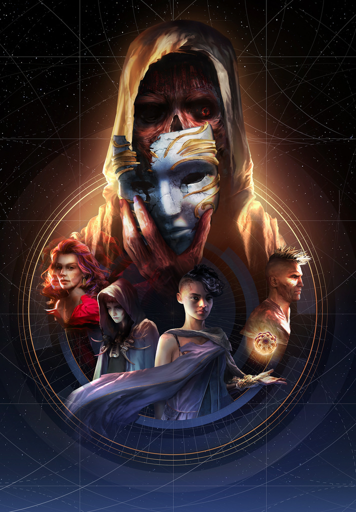
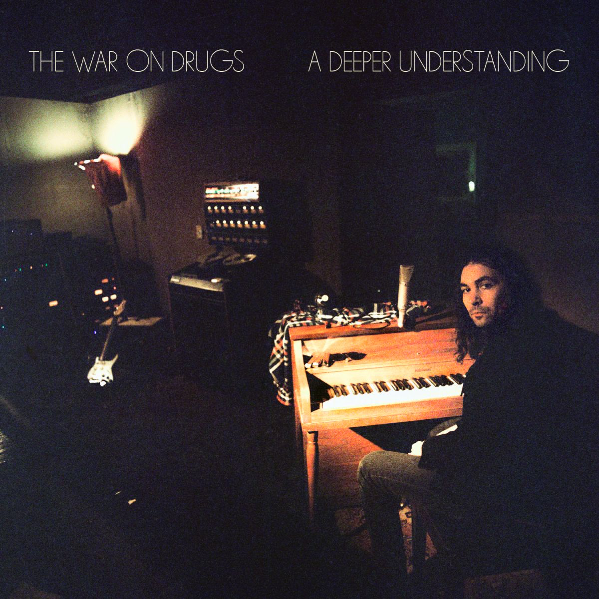
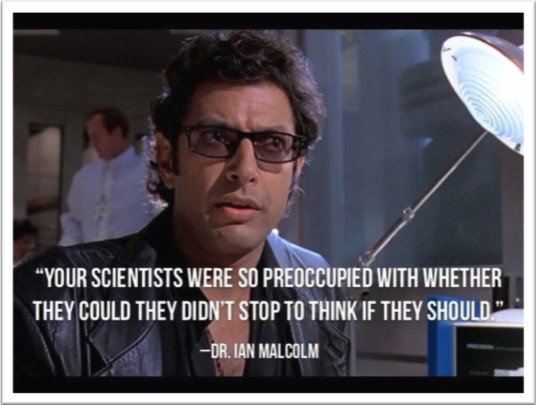

# best of '17

Hace unos meses empecé un libro de cuentos que no he terminado porque en mí es más poderoso el síndrome del impostor que el impulso creativo, al parecer. Uno de los cuentos arranca de esta manera:

> Cuando vengo a Sabinas vuelvo a creer en fantasmas. La culpa de todo la tiene El Murmullo.  
> Lo escuché la misma noche que llegué a la ciudad. Lo escuché por primera vez en años. Escribía algo en la computadora cuando Nona me pidió salir al baño. Fuimos al patio lo escuchamos. Porque Nona lo escuchaba, también. No sé por qué lo sé, pero estoy seguro que así fue. Nos sentamos sobre el piso de piedra. Después de unos minutos me sentía aturdido. Los oídos me zumbaban. Nona estaba inquieta y volvimos a la estancia.  
> En ese entonces vivíamos en la casa donde crecí, en la esquina de Francisco Villa con Jesús Acuña, en un limbo que unas veces es la colonia Del Valle y otras la Flores Magón.[^floresmagon]

2017[^2017] fue un buen año. Buena música, buen cine, buena televisión.

Primero, algo de música:

<iframe width="750" height="480" src="https://www.youtube.com/embed/Qxxz7Tgfsv4" frameborder="0" gesture="media" allow="encrypted-media" allowfullscreen></iframe>

Este año aprendí a querer a King Gizzard & The Lizard Wizard. Australia viene con todo. Ellos, Pond, Tame Impala y d.d. dumbo encabezan una pequeña avanzada de bandas propositivas y proyectos interesantes. Imagino que eventualmente escribiré al menos de Pond.



En algún punto de principios de 2017 Spotify se convirtió en mi principal forma de escuchar música. Es práctico y simple, me hace la vida más fácil y de eso se debería tratar la tecnología. Cualquier cosa que no encuentro en Spotify está en alguna otra parte y puede importarse en la misma aplicación.

Mis playlists de Spotify de este año pueden verse en los siguientes enlaces:

* [Primavera / Verano](https://open.spotify.com/user/1276246890/playlist/58rgUD1Z5PSaa3SFAQbR7S)
* [Otoño / Invierno](https://open.spotify.com/user/1276246890/playlist/5xAXP1Bvs1xitycMe1b6hK)

Este es el resumen que Spotify hizo de mi año:





Soy básico pero feliz.

***

El gran acontecimiento cultural en mi 2017 fue la tercera temporada de *Twin Peaks*. Es difícil agregar algo a todo lo que se ha hablado y escrito sobre estas impresionantes 18 horas de televisión. Maravillosa.


No podemos decir lo mismo de *Game of Thrones*.

  
[https://upload.wikimedia.org/wikipedia/commons/3/3d/Game_of_Thrones_cast_%2814118396526%29.jpg]

***

¿Hay manera de distinguir entre El Universo y La Realidad?

***

En la tercera temporada, los escritores de *The Leftovers* dejaron de lado todo intento de ser sutiles:


***

**Pond, *The Weather*.** Los australianos andan con buen promedio de bateo desde hace algunos años. Pond es algo así como una banda hermana de Tame Impala.



**D.D Dumbo, *Utopia Defeated*.** Este álbum no es del 2017 pero este año lo descubrí, así que lo incluyo aquí:



D.D Dumbo es el proyecto solista de Oliver Hugh Perry. Perry está basado en una muy pequeña ciudad (menos de 7,000 habitantes) de Australia, Castlemaine. Su música. En sus inicios, como no, abrió conciertos para Tame Impala. *Utopia Defeated* es su álbum debut, un disco que no tiene desperdicio de principio a fin y cuyo sonido (en el que predomina la electrónica) está muy influenciado por el folk, la psicodelia y el new wave.

<iframe width="560" height="315" src="https://www.youtube.com/embed/yrsfyu9N0ps" frameborder="0" gesture="media" allow="encrypted-media" allowfullscreen></iframe>

***

Mi gran (re)descubrimiento este año fue algo a lo que en algún momento y por alguna razón expresé cierto rechazo prejuicioso: el live coding. A finales de 2016 hice algunas cosas con Sonic Pi pero no me clavé con aprender otros lenguajes. Un año después de aquellos primeros experimentos, en octubre de 2017, instalé TidalCycles por primera vez y mis paradigmas musicales no volverían a ser los mismos. De esto me di cuenta casi de inmediato.  
Mi prejuicio se basa en una idea tonta, ignorante y completamente falsa: que el proyectar las pantallas de los live coders es un gesto que nace de la arrogancia. La realidad es otra. La realidad es, de hecho, todo lo contrario: como músico, al dejar expuesto el código también mostramos un poco de nuestra forma de pensar: nos volvemos vulnerables.

Un archivo de TidalCycles escrito por mí se ve más o menos así:

```haskell
-- 20171107.tidal / hptc_fail.tidal
-- created: 2017-11-07
-- modified: 2017-12-17
-- by @jarxg

cps (125/60/4)

hush

d1
$ stack [
s "bd*4"
# cutoff 500
# gain 1.5,
stut 4 0.25 0.25
$ n "[~ 4 ~ 4]*2"
# s "linnhats"
# legato 0.22
# cutoff 5500,
stut 3 0.25 1.55
$ n "~ 0 ~ 0"
# s "sd"
]

d1 silence

d2
$ stack [
every 3 palindrome
$ sometimes (jux rev)
-- $ sometimes (# legato "1")
$ every 5 (0.5 <~)
$ every 3 (0.25 <~)
$ every 4 (0.125 <~)
$ s "[future(7,16), dr(3,8), tech(7,16,5)]"
# n (irand 1000)
# slow 8 (crush (scale 3 6 sine))
# slow 16 (cutoff (scale 100 5000 sine))
# orbit 1
# room 0.2,
every 3 palindrome
$ sometimes (jux rev)
-- $ sometimes (# legato "1")
$ every 3 (0.5 <~)
$ every 4 (0.25 <~)
-- $ every 2 (0.125 <~)
-- $ striate 2
$ s "jazz(7,16)"
# n (irand 1000)
]

d2 silence

d4
$ slow 4
$ stack [
jux rev $ superimpose (gap 3) $ s "pad(6,8,5) glitch(5,8,3)"
# n (irand 1000) # speed (scale 0.25 2 $ slow 9 sine) # cutoff 1500 # legato 2,
n "e2 e1*8"
# s "supersaw" # slow 24 (legato (scale 1 7 sine / 10)) # slow 12 (crush (scale 3 6 sine)) # slow 32 (cutoff (scale 50 100 sine))
]

d4 silence
```

Antes de tocar configuro algunos parámetros en SuperCollider usando este código:

```SuperCollider
s.options.numBuffers = 1024 * 4; // + samples
s.options.memSize = 8192 * 32; // if "alloc failed" messages
s.options.maxNodes = 1024 * 1; // if drop outs and "too many nodes"

ServerOptions.devices;
s.options.outDevice = "Soundflower (2ch)";
s.options.outDevice = "Built-in Output";
s.options.outDevice = "Scarlett 2i2 USB";

s.recSampleFormat = "int16";
s.recHeaderFormat = "wav";

s.boot;
SuperDirt.start;
s.quit;

LADSPA.listPlugins

s.record;
s.stopRecording;

include("SuperDirt")
```

Una composición de Tidal puede representarse con círculos de una manera que imagino no muy distinta a la figura que enmarca a los personajes en el poster de *Torment: Tides of Numenera*, uno de mis videojuegos favoritos del año:



***

**The War on Drugs, *A Deeper Understanding*.** La banda americana de rock del momento[^twod] lanzó este disco en agosto de 2017, el cuarto de una serie de trabajos bastante buenos. Yo acababa de regresar a Saltillo y me sentía un poco perdido en el sueño.



*Lost in the Dream*, el disco anterior de The War on Drugs, fue parte de mi soundtrack personal durante los meses que pasé en Sabinas. Cuando llegó *A Deeper Understanding* lo empecé a escuchar con un poco de escepticismo. Pronto me encontré atrapado en su optimismo nostálgico.



***

[^2017]: 2017 es un número primo. 2017 = 9<sup>2</sup> + 44<sup>2</sup>.

[^twod]: No puedo creer que haya escrito semejante cursilería. Mi excusa es sólo la existencia de este párrafo: estoy al tanto de mis debilidades. Eso no significa, desde luego, que yo no piense realmente que The War on Drugs sea la banda de rock más importante de este momento de la historia de la música: estoy plenamente convencido de ello.

[^floresmagon]: Qué bonito cuando una ciudad conservadora y políticamente correcta como lo es Sabinas tiene una colonia o una calle llamada Ricardo Flores Magón. No sé qué pensaría el famoso anarquista pero a mí me parece de una tragedia y una ironía deliciosas.
