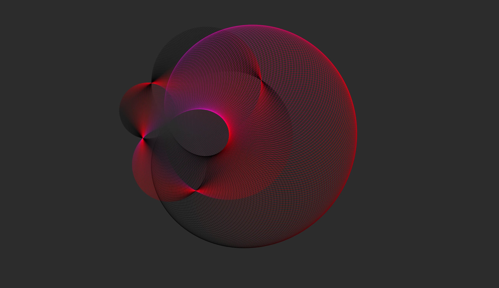

# h1 hache uno

Started writing: {{ page.date-started | date: "%Y-%-m-%-d" }}<br>
Last edited: {{ page.date-lastedited | date: "%Y-%-m-%-d" }}

## h2 hache dos

Lorem ipsum dolor sit amet, consectetur adipiscing elit. **_Sed sollicitudin nunc dolor, eu commodo tortor pellentesque vel._** Proin at venenatis dolor, ac molestie mi. `Quisque vitae rhoncus ex`. Vestibulum sed vulputate metus. Donec eget commodo mi, at efficitur mi. _Donec convallis leo a nisi dignissim pulvinar._ Vestibulum aliquet est ut venenatis tempor. Nulla eu orci aliquet, interdum odio sit amet, feugiat erat. Phasellus luctus varius lectus, sed rutrum leo egestas vitae. **Praesent vitae mauris a turpis vestibulum rhoncus. Ut elementum semper porta.** Proin vestibulum, neque id venenatis vulputate, justo sapien volutpat libero, euismod venenatis metus erat a nunc. Donec velit ex, malesuada ac tincidunt in, venenatis et ex. Phasellus feugiat non erat quis interdum.

Proin finibus accumsan pharetra. Cras metus elit, volutpat sed bibendum at, aliquet non nibh. Cras vestibulum, ligula ut vulputate sodales, metus metus sodales urna, in malesuada risus nisl eu neque. Praesent blandit ultrices nunc vel mattis. Aenean et porttitor lorem. Suspendisse congue erat eu magna mollis imperdiet. Maecenas accumsan accumsan justo, ac aliquam nibh dictum eu. Suspendisse vitae lobortis eros, ut sollicitudin dui. Aenean quis libero quis purus venenatis luctus. Nam dictum nisi vel varius finibus. Fusce et elit ac massa facilisis faucibus sed tincidunt orci.

## h2 hache dos

Morbi et ante ac enim posuere fermentum. Nunc ligula eros, ullamcorper in sagittis convallis, aliquet ut urna. Ut pellentesque ornare nunc in vestibulum. Fusce tristique viverra pulvinar. Maecenas dapibus vitae sapien in malesuada. Donec sagittis mauris sit amet enim viverra, vel feugiat mauris hendrerit. Aliquam hendrerit pretium tincidunt. Cras tristique malesuada aliquet.

## h2 hache dos

```markdown

# jorge rangel

i use computers to make images and sounds.

---

i'm on [twitter](https://www.twitter.com/jarxg)

---

## music

[tidalcycles music repository](https://github.com/jarxg/my_tidalcycles_stuff)

[discography](discography)

[bandcamp](http://jarxg.bandcamp.com), currently on hiatus

[soundcloud](https://soundcloud.com/jarxg)

## discography

- Dysmorphophobia (2006)  
- Rainy EP - Historia de un día lluvioso (2006)  
- "Mushrooms" (2008)  
- 1D EP (2008)  
- Música de Vidrio (2009)  
- Dots (2010)  
- Reverie: A Portrait of You (2010)  
- Seis Piezas Para Videos (2010)  
- Melisma: One More Portrait of You (2011)  
- "...mensajes cifrados desde un planeta más allá de Alfa Centauro" (2011)  
- Plexo (2012)  
- 38-8,1 (2012)  
- 38-8,2 (2012)  
- ghst (2012)  
- [Sentado en Baker Street](https://idmachine.bandcamp.com/album/sentado-en-baker-street) (@ [id machine](https://idmachine.bandcamp.com)) (2013)  
- [Canciones para fiestas de hipsters felices tomando aguas locas](https://idmachine.bandcamp.com/album/canciones-para-fiestas-de-hipsters-felices-tomando-aguas-locas) (@ [id machine](https://idmachine.bandcamp.com)) (2013)  
- BTL.EP (as Jar G.) (2014)  
- Lines, Vol. I (2014)  
- あなたは誰 EP (as Excel '97') (2014)  
- MOBILE EP 01 (as Jar G.) (2014)  
- [La Nave de China](https://idmachine.bandcamp.com/album/la-nave-de-china) (@ [id machine](https://idmachine.bandcamp.com)) (2014)  
- R E S P U E S T A S (@ [EXPERIMENTRÍO](https://hectorzarate.bandcamp.com)) (2015)  
- Lines, Vol. II: Hybris (2016)  
- [Schippers Straat](https://losdecadentesdelinares.bandcamp.com/album/schippers-straat) (@ [Los Decadentes de Linares](https://losdecadentesdelinares.bandcamp.com)) (2016)  
- Multi-Branched Analepsis, Vol. 1 (2016)  
- Multi​-​Branched Analepsis, Vol. 2 (2016)  
- AROUND HOME (2016)  
- [Aquí yace la máquina de escribir](https://losdecadentesdelinares.bandcamp.com/album/aqu-yace-la-m-quina-de-escribir) (@ [Los Decadentes de Linares](https://losdecadentesdelinares.bandcamp.com)) (2017)  
- [Recuerdos Divididos EP](https://jarxg.bandcamp.com/album/recuerdos-divididos-ep) ([on YouTube](https://www.youtube.com/watch?v=2B9qvX7q7Ys)) (+ [R. Yedras](https://twitter.com/ryedras)) (2017)

send me an email (mail[at]jrangel[dot]net) if you want any of the unlinked albums.

---

## video

- ♫ ["Permanencia Voluntaria"](https://vimeo.com/39743397), @ El Taller de la Caballeriza (digital video, 7'32", 2009)  
- ♫ ["Lección de Biología"](https://www.youtube.com/watch?v=5aI3PoWOjoE), + Mónica Álvarez & Julián Herbert @ El Taller de la Caballeriza (animation, 1'14", 2009)  
- [1.6180339887](https://vimeo.com/39391488), + Julián Herbert. (digital video, 5'06", 2010)  
- [Malas Palabras](https://vimeo.com/31437957), + Luis Alberto Arellano. (digital video, 1'06", 2011)  
- ✄ [El Triste Hígado](https://vimeo.com/39122549), + Efraín Velasco. (digital video, 2'51", 2012)  
- [B. 1,3](https://vimeo.com/67617810) (digital video, 9'51", 2013)
- [Le](https://vimeo.com/64741257) (digital video, 11'41", 2013)  
- [Suspensiones voluntarias de la incredulidad](https://www.youtube.com/watch?v=XAXxDKqQ2fM), + Julián Herbert (digital video, varias duraciones, 2014)
- [Gota](https://vimeo.com/100379907) (2014)  
- [Summertime](https://vimeo.com/116725751) (2015)  
- [Super 8](https://www.youtube.com/playlist?list=PLfAxzDwtu5Br0dinNBVdjVS-rP0_MwDbO) (digital video, varias duraciones, 2015-2016)  
- [Termina Coahuila principia Nuevo León: autopista de haikús](https://www.youtube.com/watch?v=75B9tsA26Ms), + Fernando Carrillo, Juan Iván González, Iveth Luna, Penélope Montes, Fer Sandoval & Edgardo Valero (digital video, 12'30", 2016)  
- [analepsis01](https://www.youtube.com/watch?v=X90kBpaTwL8) (digital video, 24'05" 2016)  
- [Molécula](https://www.youtube.com/watch?v=fqxbWxXeGmg) (digital video, 27'00", 2016)  
- analepsis02 (digital video, 12'06", 2016)  
- [AROUND HOME](https://www.youtube.com/watch?v=Tp26q7GVrm0) (digital video, 13'23", 2016)  
- Snap (digital video, 5'10", 2016)  
- ✄ ["La Luna y El Amor"](https://www.youtube.com/watch?v=XAXxDKqQ2fM), + R. Yedras (music video, 2'59", 2016)  
- ["Jardín"](https://www.youtube.com/watch?v=MBuX7ehnlD8), + R. Yedras (digital video, 4'35", 2017)
- ♫ ["West Condos"](https://www.youtube.com/watch?v=-7b3ao7ylak), + R. Yedras (digital video, 6'06", 2017)
- macrobes (digital video, 18'44", 2017)

(♫ = music only / ✄ = editing only)

---

## visual art

[instagram](https://www.instagram.com/jarxg)

---

## bots

[bots repository](https://github.com/jarxg/cheapbots)

- [@bot_de_pelis](https://twitter.com/bot_de_pelis) (2017)  
- [@NumeneraBot](https://twitter.com/NumeneraBot) (2017)

---

## twine

- [Lecture on Nothing](twine/nothing.html) (2015)

---

[cc by-nc-sa 4.0](http://creativecommons.org/licenses/by-nc-sa/4.0/)

theme based on [Solo](https://jekyllthemes.io/theme/16221683/solo) by [chibicode](https://github.com/chibicode)
```

## h2 hache dos

Vestibulum ante ipsum primis in faucibus orci luctus et ultrices posuere cubilia Curae; Cras pretium metus dui, nec facilisis mauris posuere quis. Donec elementum mattis dui, non vulputate nunc suscipit nec. Mauris tortor dui, efficitur vel pretium nec, molestie eget urna. Nunc erat arcu, consectetur sed felis sit amet, viverra eleifend arcu. Praesent vel tellus ac enim convallis consequat. Donec mattis laoreet est ac fringilla. Duis eu leo libero. Nam lacinia pulvinar augue, ut ultricies ipsum varius sit amet. Nullam augue nunc, laoreet nec ante quis, sollicitudin fringilla orci. Donec cursus ac velit quis faucibus. Phasellus mattis pretium rutrum. Integer sed sollicitudin erat. Curabitur venenatis ligula quis lorem facilisis laoreet. Nunc a erat ac ipsum commodo tempor at eu turpis. Nulla in neque turpis.

Ut suscipit nisi dui, id pretium ipsum lacinia ut. Nulla maximus auctor arcu. Sed sed lacinia quam, sed convallis mi. Morbi sit amet leo posuere, condimentum mi nec, egestas purus. Nunc vitae ligula malesuada, semper mauris vitae, fermentum mauris. Vestibulum porttitor imperdiet sapien, a vestibulum neque semper nec. Quisque luctus tortor in mollis scelerisque. Pellentesque ornare porta metus, sit amet euismod nunc pellentesque eu. Interdum et malesuada fames ac ante ipsum primis in faucibus. Nullam eu tempor leo. Mauris tempor nunc vel ornare pharetra. Sed interdum urna a lacus molestie elementum. Proin nec tellus facilisis, posuere mauris eget, aliquet elit. Vivamus et blandit dolor, ut elementum felis. Praesent sed metus quis odio ultricies gravida. Proin rutrum massa sit amet quam eleifend placerat.

[](assets/test-35d6c.png)

```haskell

cps (125/60/4)

hush

d1
$ n "[c2(11,16), e3(3,8)]"
# s "supersaw"
# vowel "i o [i e]"
# crush (scale 3 6 $ slow 3 sine)
# cutoff (scale 50 3500 $ slow 7 sine)
# legato 1

d1
$ n "[a2(5,8), c3(3,8)]"
# s "supersaw"
# crush (scale 3 6 $ slow 9 sine)
# cutoff (scale 150 1500 $ slow 7 sine)
# legato 1

d1 silence

t2 (anticipateIn 4)
$ s "bd bd bd bd"
# cutoff 500
# legato 1
# gain 2

d2
$ jux rev
$ striate 8
$ s "breaks125"
# legato 1

d2 silence

d3
$ jux rev
$ stut 3 0.5 1.25
$ s "homedepot(5,8)"
# n (irand 150)
# legato (slow 5 sine)

d3 silence

d4
$ s "bd bd bd bd"
# cutoff 1500
# gain 2

d4 silence
```

```html
<!DOCTYPE html>
<html>
<head>
    <meta charset="UTF-8">
    <meta http-equiv="X-UA-Compatible" content="IE=edge">
    <meta name="viewport" content="width=device-width, initial-scale=1">

    <title>phyllotaxis</title>

    <script src="../libraries/p5.js"></script>
    <script src="../libraries/p5.dom.js"></script>
    <script src="../libraries/p5.sound.js"></script>
    <script src="sketch.js"></script>

    <style>
        body {
            margin:0;
            padding:0;
            overflow: hidden;
        }
        canvas {
            margin:auto;
        }
    </style>
</head>
<body>
</body>
</html>
```

## h2 hache dos

Haz clic en cualquier imagen para verla en tamaño completo.

Elemento                        | Texto
:-------------------------------- | :---------
[link](test)                      | Item Two
[](assets/test-35d6c.png) | Imagen generada con el algoritmo de creación de mandalas que escribí hace un par de semanas en p5.js.

```javascript
let b = 137.5;
let c = 10;
let n = 0;

function setup() {
    createCanvas(windowWidth, windowHeight);
    angleMode(DEGREES);
    background(0);
}

function draw() {
    let a = n * b;
    let r = c * sqrt(n);
    let x = r * cos(a) + width / 2;
    let y = r * sin(a) + height / 2;
    noStroke();
    fill((tan(n) * 128), (sin(n) * 128), (atan(n) * 128));
    ellipse(x, y, 20);
    b += 0.005;
    n++;
}
```
